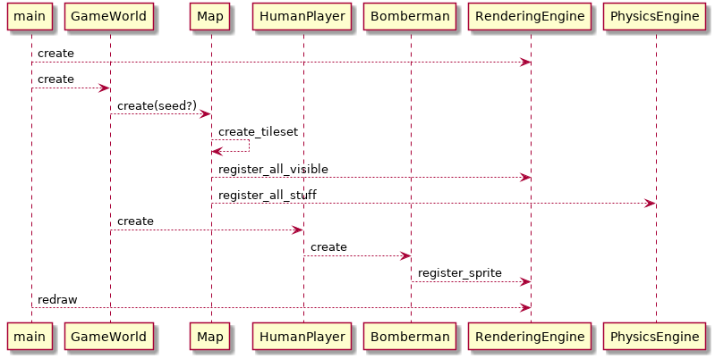
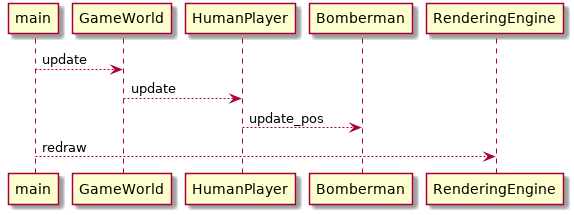
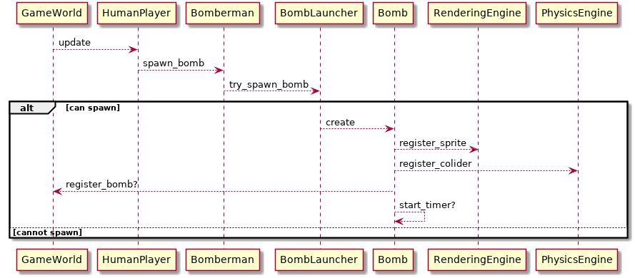
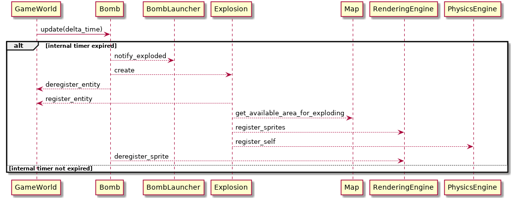
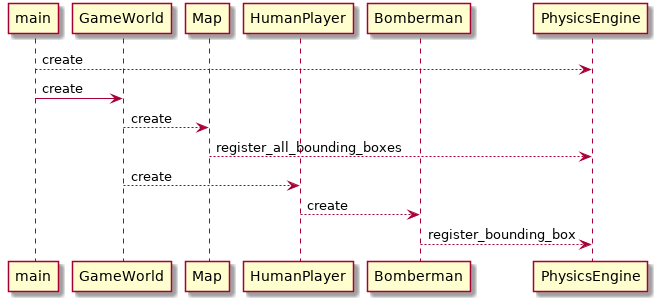
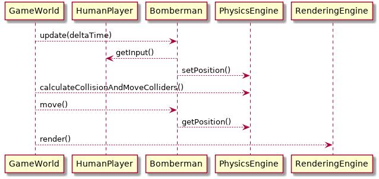

# [UC_1] As player I want my Bomberman to move

## [UC_1_1] As player I want to be able to see a board with Bomberman, grass and other stuff

## [UC_1_2] As player I want to be able to move Bomberman by keyboard input

# [UC_2] As player I want to place bombs that explode

## [UC_2_1] As player I want a bomb object to appear on map at my current positon
Bomb should appear when proper key is pressed.

## [UC_2_2] As player I want my bomb to explode when its timer expided

## [UC_2_3] As player I want explosions of my bombs to last a prededined time interval

# [UC_3] As player I want my bomberman to detect collision with walls other game entities

## [UC_3_1] As system I want PhysicsEngine to be initialized and all required objects to register with it

## [UC_3_2] As player I want PhysicsEngine to detect colisions of Bomberman with other entities

